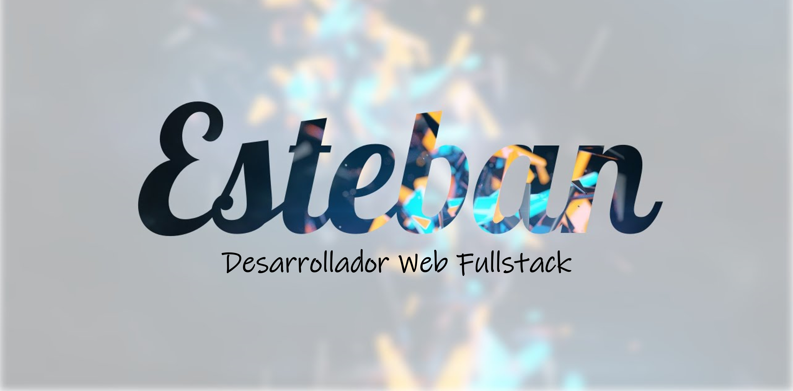

<h2>Hey there! I'm Esteban</h2>

<!-- ## 👋 &nbsp;Hey there! I'm Aditya -->

### 👨🏻‍💻 &nbsp;About Me

🚀 &nbsp;FullStack Developer with 2+ years of experience building scalable web solutions.\
💡 &nbsp;Passionate about clean code, modern tech stacks, and meticulous project organization.\
🎓 &nbsp;Computer Science graduate with a self-taught mastery of cutting-edge technologies.\
🌱 &nbsp;Focused on web development (Vue.js, Nest.js, databases) and software architecture best practices.\
📊 &nbsp;Detail-oriented optimizer: From UI/UX design to CI/CD pipelines, I streamline processes.\
✍️ &nbsp;Lifelong learner: Currently diving deeper into Nest.js and microservices.\
💬 &nbsp;Open to collaborations, mentorship, or tech chats—let’s connect!\
✉️ &nbsp;Reach me at **estebanalayon7@gmail.com** (I reply fast!).\
🔗 &nbsp;[Portfolio](https://www.estebanportafolio.com) | [LinkedIn](https://www.linkedin.com/in/esteban-alayon-318a1424a/) | [TikTok](https://www.tiktok.com/@estebanalayon7).

### 🛠 &nbsp;Tech Stack

&nbsp;
&nbsp;
&nbsp;
&nbsp;
\
&nbsp;
&nbsp;
&nbsp;
&nbsp;
&nbsp;

### 🤝🏻 &nbsp;Connect with Me

-----
Credits: [Aditya Vikram Singh](https://github.com/AVS1508)

Last Edited on: 11/12/2020
